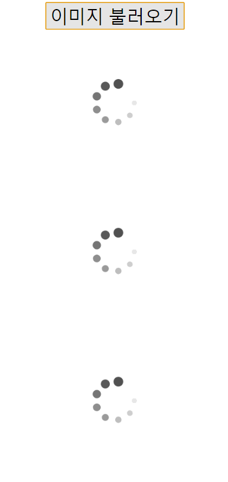
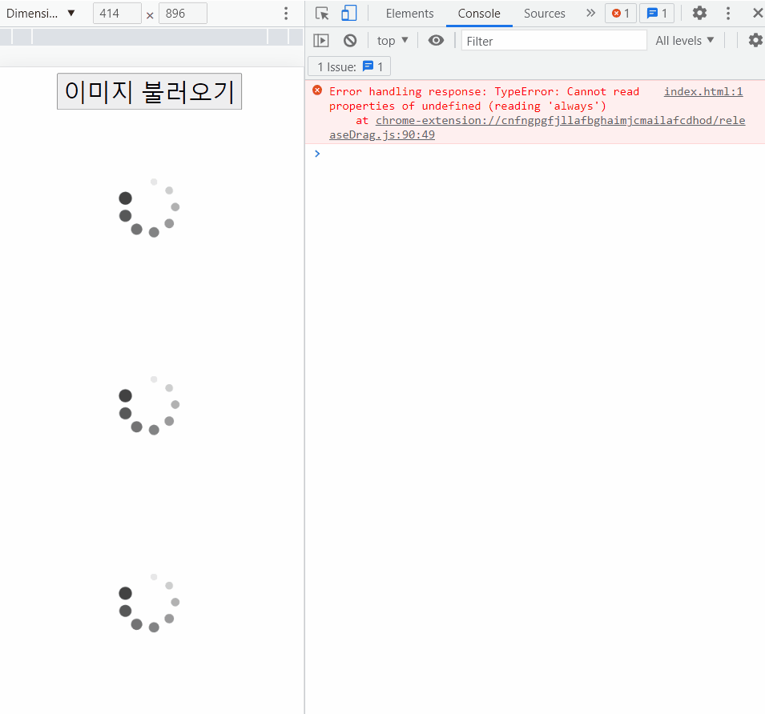
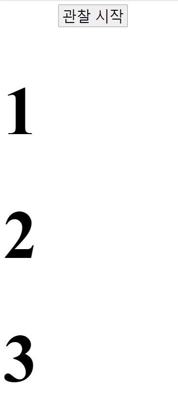
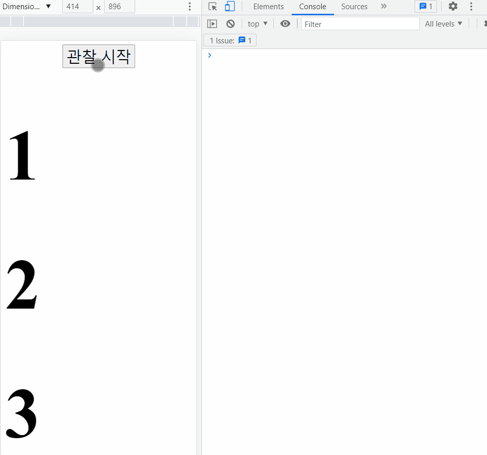
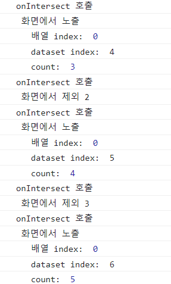

# Intersection Observer API 분석

2022년 9월 1일 

아래 링크를 참고했다.

[https://github.com/hanameee/vanillaJSKitty/blob/master/studyLog.md#4-lazy-loading-구현](https://github.com/hanameee/vanillaJSKitty/blob/master/studyLog.md#4-lazy-loading-%EA%B5%AC%ED%98%84)

### 상황 1: lazy loading 예제

다음과 같은 HTML 파일을 준비한다.

```html
<!-- index.html -->

<div class="App">
  <div style="text-align: center;">
    <button style="font-size: xx-large;">이미지 불러오기</button>
  </div>
  
  
  
  
  
  
  
  
  
</div>
<script src="./src/index.js" type="module"></script>
```

‘이미지 불러오기’ 버튼을 누르면 이벤트가 실행되는 구조다.



이를 위한 JavaScript 파일은 다음과 같다.

```javascript
// src/App.js

export default function App($target) {
  // 1. 관찰자(observer)를 생성한다.
  const observer = new IntersectionObserver(onIntersect, { threshold: 1.0 });

  // 2. 관찰 대상들을 가져온다. (여기서는 lazy 클래스들을 가져옴)
  const targets = Array.from(document.getElementsByClassName("lazy"));

  // 3. 관찰 대상들을 등록한다. (버튼을 누르자마자 등록 후 바로 관찰 시작)
  const $button = document.querySelector("button");
  $button.addEventListener("click", event => {
    targets.forEach(target => {
      observer.observe(target);
    });
  });

  /* 밑부분에 관측 대상에 대한 로직 작성 */
}
```

로직은 다음과 같다.

```javascript
/* 관측 대상을 만났을 경우에 대한 로직 */
function onIntersect(entries, observer) {
  entries.forEach((entry, index) => {
    // 관측 대상을 만난 경우
    if (entry.isIntersecting) {
      // 현재 forEach문의 index를 출력
      console.log("index: ", index);
      // 현재 이미지의 src를 대체
      entry.target.src = `https://picsum.photos/seed/${index}/200`;
      // 이미지를 불어왔으므로, 관측 대상에서 제외함
      observer.unobserve(entry.target);
    }
  });
}
```

(원래는 맨 처음에 정의해서 IntersectionObserver에 넣어야 하나,
흐름 이해를 위해 나중에 정의함.)

### 결과

- 스크롤에 따라 이미지가 lazy loading 되는 걸 볼 수 있다.
- 특이하게, 처음 화면에 보이는 대상들에는 index가 순서대로 들어가나,
  이후부터는 index가 0으로만 나온다?…



### 상황 2

보다 자세한 작동 원리를 이해하기 위해, 다른 예시를 준비했다.

다음과 같은 HTML을 준비했다.
몇 번째 대상인지 알기 위해 h1 태그로 바꾸고 숫자를 넣어줬다.
그리고 각 태그마다 따로 data-index를 넣어서, 태그 고유의 인덱스를 알아내도록 했다.

```jsx
<div class="App">
  <div style="text-align: center;">
    <button style="font-size: xx-large;">관찰 시작</button>
  </div>
  <h1 class="lazy" data-index="1">1</h1>
  <h1 class="lazy" data-index="2">2</h1>
  <h1 class="lazy" data-index="3">3</h1>
  <h1 class="lazy" data-index="4">4</h1>
  <h1 class="lazy" data-index="5">5</h1>
  <h1 class="lazy" data-index="6">6</h1>
  <h1 class="lazy" data-index="7">7</h1>
  <h1 class="lazy" data-index="8">8</h1>
  <h1 class="lazy" data-index="9">9</h1>
</div>
```

앞서 마찬가지로 관찰 시작을 누르면 관찰 대상들이 등록된다.



JavaScript 파일은 다음과 같다.

이 부분은 앞과 완전히 똑같다.

```jsx
// src/App.js

export default function App($target) {
  // 1. 관찰자(observer)를 생성한다.
  const observer = new IntersectionObserver(onIntersect, { threshold: 1.0 });

  // 2. 관찰 대상들을 가져온다. (여기서는 lazy 클래스들을 가져옴)
  const targets = Array.from(document.getElementsByClassName("lazy"));

  // 3. 관찰 대상들을 등록한다. (버튼을 누르자마자 등록 후 바로 관찰 시작)
  const $button = document.querySelector("button");
  $button.addEventListener("click", event => {
    targets.forEach(target => {
      observer.observe(target);
    });
  });

  /* 밑부분에 관측 대상에 대한 로직 작성 */
}
```

로직 부분에서는 log를 출력하기로 했다.

```jsx
/* 관측 대상을 만났을 경우에 대한 로직 */
function onIntersect(entries, observer) {
  // 관측 대상을 만나거나 놓치면 무조건 실행
  console.log("onIntersect 호출");

  entries.forEach((entry, index) => {
    if (entry.isIntersecting) {
      console.log(" 화면에서 노출");
      console.log("   배열 index: ", index);
      console.log("   dataset index: ", entry.target.dataset.index);
    } else {
      console.log(" 화면에서 제외", entry.target.dataset.index);
    }
  });
}
```

### 결과

- 처음에는 모든 관찰 대상(entries)에 대해 실행된다.
  이는 처음 화면에 없던 4~9까지도 출력되는 걸 볼 수 있다.
  만약 if (entry.isIntersecting) 조건문이 없었다면 모든 대상들이 실행되었을 것이다.
- 그 다음부턴 관찰 대상이 보이거나 안 보이게 되면 
  해당 대상들에 대해서만 callback이 실행된다.
- 이로써 앞선 예시에서 index가 0으로 나오는 이유를 알 수 있다.
  교차하는 대상에 대해서만 callback이 실행되므로,
  대상은 항상 1~2개일 것이고, 이에 따라 index는 0이 나오는 것이다.



### 상황 3

callback이 항상 고정되어 있는지 알아보기 위해, 전역변수 count를 추가해줬다.
그리고 호출될 때마다 count를 1씩 증가시켰다.

### 결과

- 고정되어 있지 않고, 일반적인 callback 메서드처럼 다른 변수도 문제없이 쓸 수 있다.



### 결론

- 처음엔 모든 관측 대상에 대해 실행된다.
- 이때 entry.isIntersecting으로 화면에 있는 것들만 걸러낼 필요가 있다.
- 이후로는 관측 대상이 화면에 들어오거나 나갈 때만 callback이 실행된다.